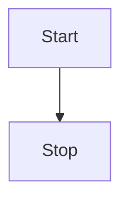
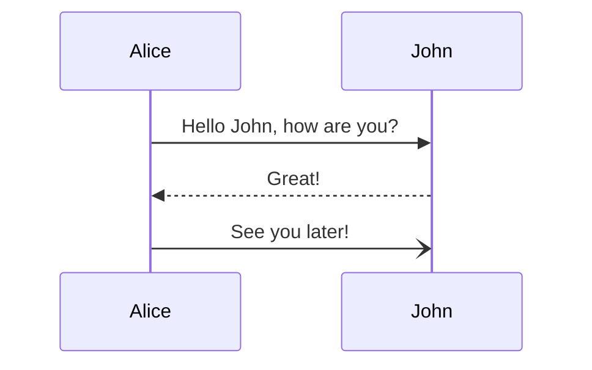
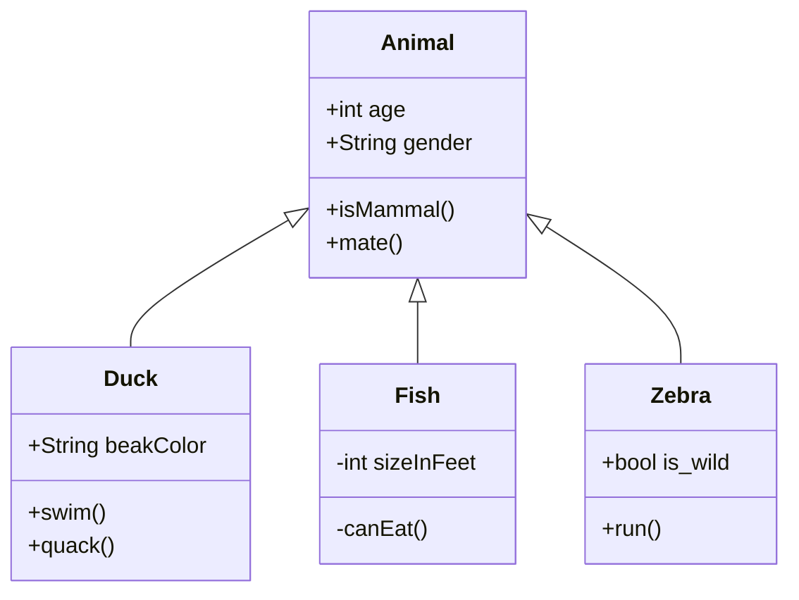

# 文笥  
一款 Markdown 管理工具，就是掘金的那款  
文[笥](https://www.zdic.net/hans/%E7%AC%A5)，这个名字是AI给我取的。笥的本义:一种盛饭食或衣物的竹器，就是希望文字像饭食，衣服一样有个东西给他装起来，文字创造要像吃饭穿衣服一样坚持。 
### 技术栈
使用 Vue+Vite+Electron+sqlite开发  
点击 `左上角图标` 回到根目录文档（本文档）   

## 开放源代码使用  
UI框架使用  [Naiveui](https://github.com/tusen-ai/naive-ui)  
Markdown编辑器使用 [bytemd](https://github.com/bytedance/bytemd)  
英文字体 [FiraCode](https://github.com/tonsky/FiraCode)  
中文字体 [霞鹜文楷](https://github.com/lxgw/LxgwWenKai)   
electron框架 [electron](https://github.com/electron/electron)  
Vue渲染框架 [Vue地址](https://github.com/vuejs/vue)  
其他的不一一列举了  
  
## Markdown简介

> Markdown 是一种轻量级标记语言，创始人为约翰·格鲁伯（John Gruber）。 它允许人们使用易读易写的纯文本格式编写文档，然后转换成有效的 XHTML（或者HTML）文档。—— [百度百科](https://baike.baidu.com/item/markdown)  

### 代码块
``` python
@requires_authorization
def somefunc(param1='', param2=0):
    '''A docstring'''
    if param1 > param2: # interesting
        print 'Greater'
    return (param2 - param1 + 1) or None
class SomeClass:
    pass
>>> message = '''interpreter
... prompt'''
```  
### LaTeX 公式

可以创建行内公式，例如 $\Gamma(n) = (n-1)!\quad\forall n\in\mathbb N$。  

或者块级公式：

$$	x = \dfrac{-b \pm \sqrt{b^2 - 4ac}}{2a} $$

### 表格
| Item      |    Value | Qty  |
| :-------- | --------:| :--: |
| Computer  | 1600 USD |  5   |
| Phone     |   12 USD |  12  |
| Pipe      |    1 USD | 234  |
 
 
### 图表  







### 复选框

使用 `- [ ]` 和 `- [x]` 语法可以创建复选框，实现 todo-list 等功能。例如：

- [x] 已完成事项
- [ ] 待办事项1
- [ ] 待办事项2


